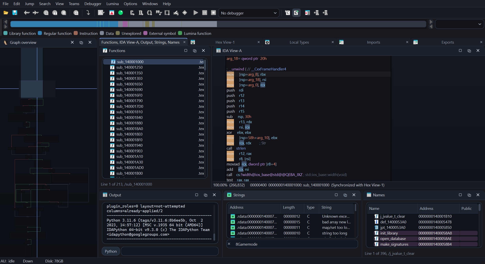

# IDAPro-MuiLs

[English](README.md) | [English tutorial](docs/TUTORIAL.md)

[](https://github.com/PoP-Lin/IDAPro-MuiLs/actions/workflows/ci.yml)
[](LICENSE)

IDAPro-MuiLs 是面向 IDA Pro 9.3 的现代化桌面主题。项目由 IDAPython 插件和
限定作用域的 Qt 样式表组成，在改善内置界面的同时，尽量保持 IDA 原生行为以及
第三方插件面板的兼容性。



## 主要特性

- 随 IDA 自动启动，并记住主题启用状态。
- 统一菜单、工具栏、标签、Dock、拖放提示、表格、树、滚动条、Output、图形视图、
  对话框、快速搜索框和 Windows 深色标题栏的视觉样式。
- Functions、Names 和 Strings 的选中背景跨列连续，仅在整行左右边缘绘制圆角。
- 为 Output、Strings、Names 和内置项目树提供一致的内嵌表面，不改变数据模型和交互。
- 自动识别兼容的 Qt 插件 Dock，并对卡片、搜索、列表、控制台和状态区域应用限定样式。
- 支持界面字体、代码字体、强调色、密度和圆角大小，并可实时预览。
- 在系统窗口缩放期间减少中间帧的布局工作，结束时执行一次完整布局与重绘。
- 无需重启即可恢复 IDA 原生外观。

## 兼容性

| 组件 | 支持范围 |
| --- | --- |
| IDA Pro | 9.3 |
| IDAPython | Python 3.10 或 3.11 |
| Qt 绑定 | PySide6 / Qt 6 |
| 目标系统 | Windows 11 与 macOS |
| 完整 IDA 验证 | Windows 11，包含 150% 显示缩放 |

在 macOS 上，Qt 主题使用系统标准窗口外观，并跳过 Windows 专属 DWM 效果。
自动化 Qt 检查覆盖两个目标系统；完整的 IDA 交互验证目前在 Windows 11 上执行。
Linux 不属于支持目标。安装和开发本插件都不需要 IDA SDK。

## 安装

### 使用 GitHub Release

1. 退出 IDA。
2. 从 GitHub Releases 下载 `IDAPro-MuiLs-v1.0.0.zip`。
3. 将压缩包直接解压到 IDA 的 `plugins` 目录。
4. 启动 IDA。

解压后的结构应为：

```text
plugins/
|-- ida_modern_ui_loader.py
`-- ida_modern_ui/
    |-- plugin.py
    |-- themes/
    |-- project_docs/
    |   |-- CONTRIBUTING.md
    |   |-- LICENSE
    |   |-- README.md
    |   |-- README.zh-CN.md
    |   `-- docs/
    |       |-- TUTORIAL.md
    |       `-- images/
    |           `-- overview.png
    `-- ...
```

### 从源码安装

在项目根目录运行事务式安装脚本：

```powershell
.\scripts\install.ps1 -PluginsDirectory "C:\Path\To\IDA\plugins"
```

安装器会共同暂存并校验 loader 与插件包。替换失败时，会先恢复旧版本再返回错误。
更新完成后请重新启动 IDA，以重新载入 Python 模块和 SVG 资源。

### 卸载

退出 IDA，然后从 `plugins` 目录删除：

```text
ida_modern_ui_loader.py
ida_modern_ui/
```

用户设置独立保存在 IDA 用户配置目录下的 `modern_ui/config.json`。只有不再需要
保留设置时才删除该目录。

## 使用方式

- `Ctrl+Alt+M`：启用或关闭主题，并保存状态。
- `Ctrl+Alt+Shift+M`：打开带实时预览的设置窗口。
- `Edit > IDAPro-MuiLs Settings...`：通过菜单打开设置窗口。

## 插件面板集成

兼容的 Dock 内容根节点会被自动识别。插件也可以显式注册，并为子控件设置语义角色：

```python
from ida_modern_ui import register_plugin_panel, set_plugin_panel_role

register_plugin_panel(panel_root)
set_plugin_panel_role(toolbar, "toolbar")
set_plugin_panel_role(search_edit, "search")
set_plugin_panel_role(result_tree, "tree")
set_plugin_panel_role(result_tree.header(), "header")
set_plugin_panel_role(log_console, "console")
set_plugin_panel_role(summary_frame, "surface")
set_plugin_panel_role(empty_label, "empty")
set_plugin_panel_role(count_label, "badge")
```

自动识别的面板会为常规工具栏、搜索框、树/表格/列表、表头和文本控制台分配角色。
显式角色在主题切换后仍会保留。适配器不会修改分割比例、布局边距、行高、表头大小、
工具栏图标大小或控件自身的样式表。需要完全自定义外观时，可调用
`unregister_plugin_panel(panel_root)`。

## 开发与验证

```powershell
python -m pip install -r requirements-ci.txt
python scripts/run_checks.py --require-qt
python -m ruff check src scripts ida_modern_ui_loader.py --select E9,F63,F7,F82
python scripts/build_release.py
```

构建命令会在 `dist/` 中生成可复现的 ZIP 和 SHA256 文件。GitHub Actions 会在
Windows Python 3.10/3.11 以及 macOS Python 3.11 上运行检查；推送 `v1.0.0`
格式的标签后，会自动构建并发布对应版本。

详细贡献要求见 [CONTRIBUTING.md](CONTRIBUTING.md)。
完整英文教程见 [docs/TUTORIAL.md](docs/TUTORIAL.md)。

## 许可证与商标

本项目采用 [MIT License](LICENSE)。

本项目为独立社区项目，与 Hex-Rays 不存在隶属或官方认可关系。IDA 和 IDA Pro 是
Hex-Rays SA 的商标。
